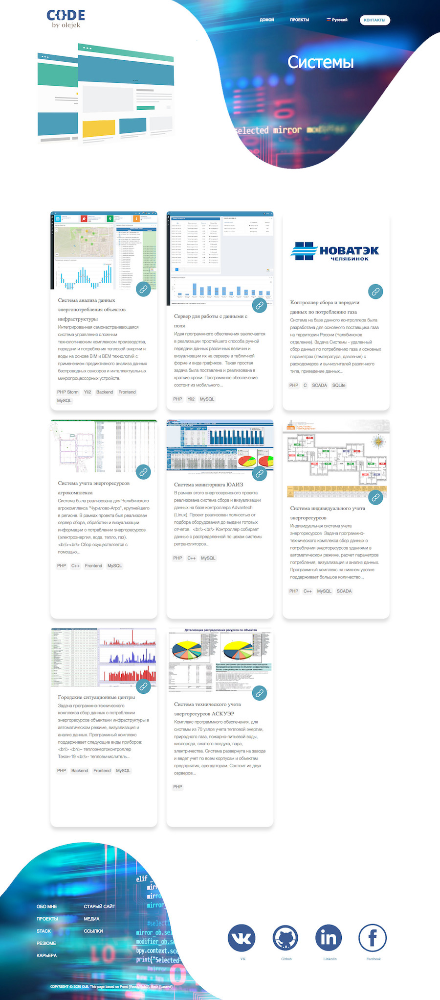

# shtrm.ru (olejek8.ru)
My personal page Frontend, experience and CV in details.
The fourth version of a personal website in 20 years. React / Mobx, Backend Laravel was used as Frontend, instead of the more familiar Yii2. As it turned out, implementing the admin panel and API in Laravel is easier. Site implemented
in three languages (i18n) and contains most of the applications, systems, data access interfaces, SCADA descriptions
projects, links to Github repositories.
 

